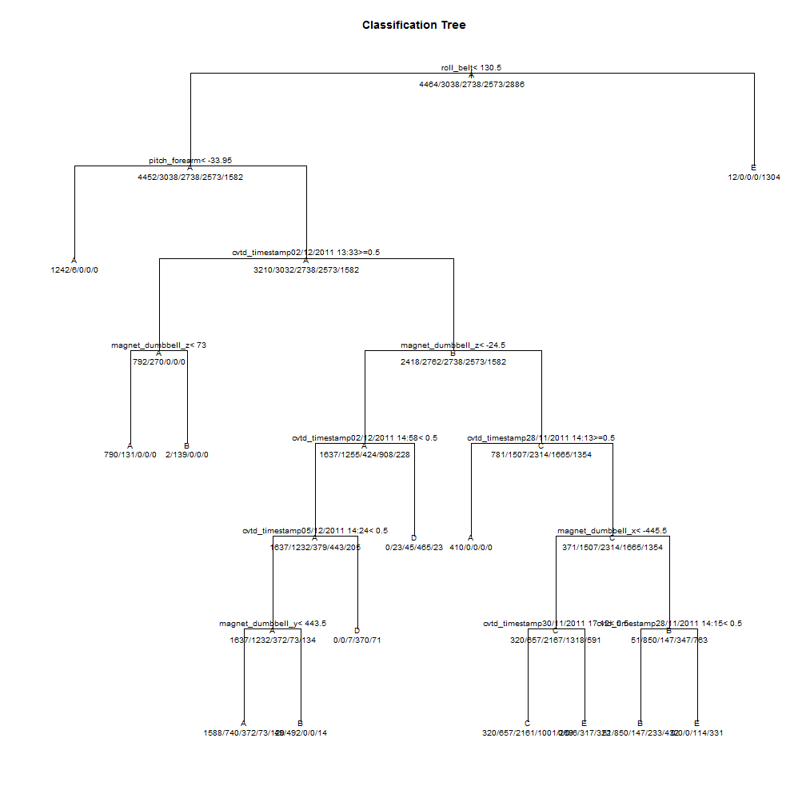

Practical Machine Learning Course Project Writeup
========================================================

Backgrouond
===========

  This is an R Markdown document using knitr to generate the HTML report. 
  
  Using devices such as Jawbone Up, Nike FuelBand, and Fitbit it is now possible to collect a large amount of data about personal activity relatively inexpensively. These type of devices are part of the quantified self movement - a group of enthusiasts who take measurements about themselves regularly to improve their health, to find patterns in their behavior, or because they are tech geeks. One thing that people regularly do is quantify how much of a particular activity they do, but they rarely quantify how well they do it. In this project, your goal will be to use data from accelerometers on the belt, forearm, arm, and dumbell of 6 participants. They were asked to perform barbell lifts correctly and incorrectly in 5 different ways. More information is available from the website here: (http://groupware.les.inf.puc-rio.br/har) (see the section on the Weight Lifting Exercise Dataset). 
  
  
Data
====
  The training data for this project are available here: https://d396qusza40orc.cloudfront.net/predmachlearn/pml-training.csv
  
  The test data are available here: https://d396qusza40orc.cloudfront.net/predmachlearn/pml-testing.csv
  
  The data for this project come from this source: http://groupware.les.inf.puc-rio.br/har. If you use the document you create for this class for any purpose please cite them as they have been very generous in allowing their data to be used for this kind of assignment. 

Required Libraries
==================
## Please make sure you have these libraries installed.

```r
install.packages("ggplot")
install.packages("lattice")
install.packages("RCurl")
install.packages("dplyr")
install.packages("plyr")
install.packages("caret")
```
## load the libraries

```r
library(ggplot2)
```

```
## Warning: package 'ggplot2' was built under R version 3.2.1
```

```r
library(lattice)
library(RCurl)
```

```
## Loading required package: bitops
```

```r
library(dplyr)
```

```
## 
## Attaching package: 'dplyr'
## 
## The following objects are masked from 'package:stats':
## 
##     filter, lag
## 
## The following objects are masked from 'package:base':
## 
##     intersect, setdiff, setequal, union
```

```r
library(grid)
library(plyr)
```

```
## -------------------------------------------------------------------------
## You have loaded plyr after dplyr - this is likely to cause problems.
## If you need functions from both plyr and dplyr, please load plyr first, then dplyr:
## library(plyr); library(dplyr)
## -------------------------------------------------------------------------
## 
## Attaching package: 'plyr'
## 
## The following objects are masked from 'package:dplyr':
## 
##     arrange, count, desc, failwith, id, mutate, rename, summarise,
##     summarize
```

```r
library(caret)
```

```
## Warning: package 'caret' was built under R version 3.2.1
```


## download the data file from the website.

```r
trainfileUrl <- "https://d396qusza40orc.cloudfront.net/predmachlearn/pml-training.csv"
download.file(trainfileUrl, destfile = "./pml-training.csv", method="libcurl")
testfileUrl <- "https://d396qusza40orc.cloudfront.net/predmachlearn/pml-testing.csv"
download.file(testfileUrl, destfile = "./pml-testing.csv", method="libcurl")
```

## Loading and preprocessing the data
load the data file into a data.frame

```r
colList <- c(3,4,6:11,37:49,60:68,84:86,102,113:124,140,151:160)
colList <- c(5, 8:11, 37:49, 60:68, 84:86, 102, 113:124, 140, 151:160)
colList <- c(5:13,15:16,18:160)
colList <- c(5, 8:11, 37:49, 60:68, 84:86, 113:124, 151:160)
colList <- c(5, 8:10, 37:48, 60:68, 84:86, 113:124, 151:160)
exColList <- c(1,2,3,4,14,17,26,89,92, 101,127,130,139)
set.seed(1234)
traindatafilename <- "pml-training.csv"
trainrawdata <- read.csv(traindatafilename, sep=",", header=TRUE,skipNul=TRUE, na.strings=c("NA"))
trainIndex1 <- createDataPartition(y=trainrawdata[,160], p=0.80, list=FALSE)
traindata1 <- trainrawdata[trainIndex1,colList]
traindata2 <- trainrawdata[-trainIndex1,colList]
#traindata1 <- trainrawdata[,colList]


testdatafilename <- "pml-testing.csv"
testrawdata <- read.csv(testdatafilename, sep=",", header=TRUE)
testdata1 <- testrawdata[,colList]
#ggplot(traindata1, aes(x=roll_forearm, y=pitch_forearm)) + geom_point(color="steelblue", size=4, alpha=1/2) + facet_grid( . ~ classe)
#ggplot(traindata1, aes(x=roll_forearm, y=yaw_forearm)) + geom_point(color="steelblue", size=4, alpha=1/2) + facet_grid( . ~ classe)
```


```r
str(traindata1)
summary(traindata1)
#head(testdata1)
```


```r
str(testdata1)
summary(testdata1)
head(testdata1)
```

## Train for the model with the train data set.

```r
#fit1 <- train(classe ~ ., method="rpart", data=traindata1)
train_control <- trainControl(method="adaptive_cv", number=10, repeats=5)
fit1 <- train(classe ~ ., method="rpart2", data=traindata1, trControl=train_control)
```

```
## Loading required package: rpart
```

```
## Warning in data.frame(..., check.names = FALSE): row names were found from
## a short variable and have been discarded
```

```
## Warning in data.frame(..., check.names = FALSE): row names were found from
## a short variable and have been discarded
```

```
## Warning in data.frame(..., check.names = FALSE): row names were found from
## a short variable and have been discarded
```

```
## Warning in data.frame(..., check.names = FALSE): row names were found from
## a short variable and have been discarded
```

```
## Warning in data.frame(..., check.names = FALSE): row names were found from
## a short variable and have been discarded
```

```
## Warning in data.frame(..., check.names = FALSE): row names were found from
## a short variable and have been discarded
```

```
## Warning in data.frame(..., check.names = FALSE): row names were found from
## a short variable and have been discarded
```

```
## Warning in data.frame(..., check.names = FALSE): row names were found from
## a short variable and have been discarded
```

```
## Warning in data.frame(..., check.names = FALSE): row names were found from
## a short variable and have been discarded
```

```
## Warning in data.frame(..., check.names = FALSE): row names were found from
## a short variable and have been discarded
```

```
## Warning in data.frame(..., check.names = FALSE): row names were found from
## a short variable and have been discarded
```

```
## Warning in data.frame(..., check.names = FALSE): row names were found from
## a short variable and have been discarded
```

```
## Warning in data.frame(..., check.names = FALSE): row names were found from
## a short variable and have been discarded
```

```
## Warning in data.frame(..., check.names = FALSE): row names were found from
## a short variable and have been discarded
```

```
## Warning in data.frame(..., check.names = FALSE): row names were found from
## a short variable and have been discarded
```

```
## Warning in data.frame(..., check.names = FALSE): row names were found from
## a short variable and have been discarded
```

```
## Warning in data.frame(..., check.names = FALSE): row names were found from
## a short variable and have been discarded
```

```
## Warning in data.frame(..., check.names = FALSE): row names were found from
## a short variable and have been discarded
```

```
## Warning in data.frame(..., check.names = FALSE): row names were found from
## a short variable and have been discarded
```

```
## Warning in data.frame(..., check.names = FALSE): row names were found from
## a short variable and have been discarded
```

```
## Warning in data.frame(..., check.names = FALSE): row names were found from
## a short variable and have been discarded
```

```
## Warning in data.frame(..., check.names = FALSE): row names were found from
## a short variable and have been discarded
```

```
## Warning in data.frame(..., check.names = FALSE): row names were found from
## a short variable and have been discarded
```

```
## Warning in data.frame(..., check.names = FALSE): row names were found from
## a short variable and have been discarded
```

```
## Warning in data.frame(..., check.names = FALSE): row names were found from
## a short variable and have been discarded
```

```
## Warning in data.frame(..., check.names = FALSE): row names were found from
## a short variable and have been discarded
```

```
## Warning in data.frame(..., check.names = FALSE): row names were found from
## a short variable and have been discarded
```

```
## Warning in data.frame(..., check.names = FALSE): row names were found from
## a short variable and have been discarded
```

```
## Warning in data.frame(..., check.names = FALSE): row names were found from
## a short variable and have been discarded
```

```
## Warning in data.frame(..., check.names = FALSE): row names were found from
## a short variable and have been discarded
```

```
## Warning in data.frame(..., check.names = FALSE): row names were found from
## a short variable and have been discarded
```

```
## Warning in data.frame(..., check.names = FALSE): row names were found from
## a short variable and have been discarded
```

```
## Warning in data.frame(..., check.names = FALSE): row names were found from
## a short variable and have been discarded
```

```
## Warning in data.frame(..., check.names = FALSE): row names were found from
## a short variable and have been discarded
```

```
## Warning in data.frame(..., check.names = FALSE): row names were found from
## a short variable and have been discarded
```

```
## Warning in data.frame(..., check.names = FALSE): row names were found from
## a short variable and have been discarded
```

```
## Warning in data.frame(..., check.names = FALSE): row names were found from
## a short variable and have been discarded
```

```
## Warning in data.frame(..., check.names = FALSE): row names were found from
## a short variable and have been discarded
```

```
## Warning in data.frame(..., check.names = FALSE): row names were found from
## a short variable and have been discarded
```

```
## Warning in data.frame(..., check.names = FALSE): row names were found from
## a short variable and have been discarded
```

```
## Warning in data.frame(..., check.names = FALSE): row names were found from
## a short variable and have been discarded
```

```
## Warning in data.frame(..., check.names = FALSE): row names were found from
## a short variable and have been discarded
```

```
## Warning in data.frame(..., check.names = FALSE): row names were found from
## a short variable and have been discarded
```

```
## Warning in data.frame(..., check.names = FALSE): row names were found from
## a short variable and have been discarded
```

```
## Warning in data.frame(..., check.names = FALSE): row names were found from
## a short variable and have been discarded
```

```r
#fit1 <- train(classe ~ ., method="ada", data=traindata1, trControl=train_control)
#fit1 <- train(classe ~ ., method="bartMachine", data=traindata1, trControl=train_control)
fit1
```

```
## CART 
## 
## 15699 samples
##    49 predictor
##     5 classes: 'A', 'B', 'C', 'D', 'E' 
## 
## No pre-processing
## Resampling: Adaptively Cross-Validated (10 fold, repeated 5 times) 
## 
## Summary of sample sizes: 14129, 14128, 14130, 14132, 14129, 14127, ... 
## 
## Resampling results across tuning parameters:
## 
##   maxdepth  Accuracy   Kappa      Accuracy SD  Kappa SD     .B 
##   1         0.3665097  0.1250966  0.003870423  0.005726367    5
##   6         0.5395645  0.4143628  0.009240254  0.023222426    5
##   7         0.5102430  0.3559690  0.107486986  0.168073185  140
## 
## Accuracy was used to select the optimal model using  the largest value.
## The final value used for the model was maxdepth = 7.
```

```r
print(fit1$finalModel)
```

```
## n= 15699 
## 
## node), split, n, loss, yval, (yprob)
##       * denotes terminal node
## 
##   1) root 15699 11235 A (0.28 0.19 0.17 0.16 0.18)  
##     2) roll_belt< 130.5 14383  9931 A (0.31 0.21 0.19 0.18 0.11)  
##       4) pitch_forearm< -33.95 1248     6 A (1 0.0048 0 0 0) *
##       5) pitch_forearm>=-33.95 13135  9925 A (0.24 0.23 0.21 0.2 0.12)  
##        10) cvtd_timestamp02/12/2011 13:33>=0.5 1062   270 A (0.75 0.25 0 0 0)  
##          20) magnet_dumbbell_z< 73 921   131 A (0.86 0.14 0 0 0) *
##          21) magnet_dumbbell_z>=73 141     2 B (0.014 0.99 0 0 0) *
##        11) cvtd_timestamp02/12/2011 13:33< 0.5 12073  9311 B (0.2 0.23 0.23 0.21 0.13)  
##          22) magnet_dumbbell_z< -24.5 4452  2815 A (0.37 0.28 0.095 0.2 0.051)  
##            44) cvtd_timestamp02/12/2011 14:58< 0.5 3896  2259 A (0.42 0.32 0.097 0.11 0.053)  
##              88) cvtd_timestamp05/12/2011 14:24< 0.5 3448  1811 A (0.47 0.36 0.11 0.021 0.039)  
##               176) magnet_dumbbell_y< 443.5 2893  1305 A (0.55 0.26 0.13 0.025 0.041) *
##               177) magnet_dumbbell_y>=443.5 555    63 B (0.088 0.89 0 0 0.025) *
##              89) cvtd_timestamp05/12/2011 14:24>=0.5 448    78 D (0 0 0.016 0.83 0.16) *
##            45) cvtd_timestamp02/12/2011 14:58>=0.5 556    91 D (0 0.041 0.081 0.84 0.041) *
##          23) magnet_dumbbell_z>=-24.5 7621  5307 C (0.1 0.2 0.3 0.22 0.18)  
##            46) cvtd_timestamp28/11/2011 14:13>=0.5 410     0 A (1 0 0 0 0) *
##            47) cvtd_timestamp28/11/2011 14:13< 0.5 7211  4897 C (0.051 0.21 0.32 0.23 0.19)  
##              94) magnet_dumbbell_x< -445.5 5053  2886 C (0.063 0.13 0.43 0.26 0.12)  
##               188) cvtd_timestamp30/11/2011 17:12< 0.5 4408  2247 C (0.073 0.15 0.49 0.23 0.061) *
##               189) cvtd_timestamp30/11/2011 17:12>=0.5 645   323 E (0 0 0.0093 0.49 0.5) *
##              95) magnet_dumbbell_x>=-445.5 2158  1308 B (0.024 0.39 0.068 0.16 0.35)  
##               190) cvtd_timestamp28/11/2011 14:15< 0.5 1713   863 B (0.03 0.5 0.086 0.14 0.25) *
##               191) cvtd_timestamp28/11/2011 14:15>=0.5 445   114 E (0 0 0 0.26 0.74) *
##     3) roll_belt>=130.5 1316    12 E (0.0091 0 0 0 0.99) *
```

```r
plot(fit1$finalModel, uniform=TRUE, main="Classification Tree")
text(fit1$finalModel, use.n=TRUE, all=TRUE, cex=0.8)
```

 


## Now predict with the test data set.

```r
prediction2 <- predict(fit1, newdata=traindata2)
summary(prediction2)
```

```
##    A    B    C    D    E 
## 1385  604 1115  224  595
```

```r
str(prediction2)
```

```
##  Factor w/ 5 levels "A","B","C","D",..: 1 1 1 1 1 1 1 1 1 1 ...
```

Check how good is the prediction.

```r
confusionMatrix(prediction2, traindata2$classe)
```

```
## Confusion Matrix and Statistics
## 
##           Reference
## Prediction    A    B    C    D    E
##          A 1005  242   89   16   33
##          B   37  363   36   64  104
##          C   72  148  550  262   83
##          D    0    6    6  191   21
##          E    2    0    3  110  480
## 
## Overall Statistics
##                                           
##                Accuracy : 0.66            
##                  95% CI : (0.6449, 0.6748)
##     No Information Rate : 0.2845          
##     P-Value [Acc > NIR] : < 2.2e-16       
##                                           
##                   Kappa : 0.5657          
##  Mcnemar's Test P-Value : < 2.2e-16       
## 
## Statistics by Class:
## 
##                      Class: A Class: B Class: C Class: D Class: E
## Sensitivity            0.9005  0.47826   0.8041  0.29705   0.6657
## Specificity            0.8646  0.92383   0.8256  0.98994   0.9641
## Pos Pred Value         0.7256  0.60099   0.4933  0.85268   0.8067
## Neg Pred Value         0.9563  0.88069   0.9523  0.87780   0.9276
## Prevalence             0.2845  0.19347   0.1744  0.16391   0.1838
## Detection Rate         0.2562  0.09253   0.1402  0.04869   0.1224
## Detection Prevalence   0.3530  0.15396   0.2842  0.05710   0.1517
## Balanced Accuracy      0.8826  0.70105   0.8148  0.64349   0.8149
```

```r
table(prediction2)
```

```
## prediction2
##    A    B    C    D    E 
## 1385  604 1115  224  595
```


```r
prediction1 <- predict(fit1, newdata=testdata1)
summary(prediction1)
```

```
## A B C D E 
## 9 3 4 0 4
```

```r
table(prediction1)
```

```
## prediction1
## A B C D E 
## 9 3 4 0 4
```


